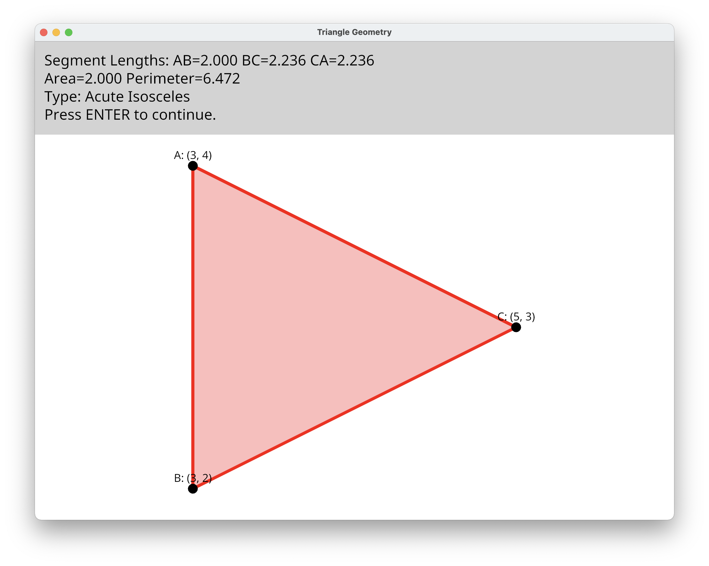

# League Challenge 1 - Triangle Geometry



This program is a submission for the first Swinburne Comp Sci/IT Discord programming challenge. It calculates and displays various properties of a triangle given as three XY coordinates.

## How to Run

Ensure you have an recent version of Rust installed on your system. This project was developed and tested on Rust 1.59.0, however earlier versions will most likely work as well.

To run the program in interactive input mode:
```
cargo run
```

To run it with an input file (e.g. example_input.txt):
```
cargo run -- example_input.txt
```
